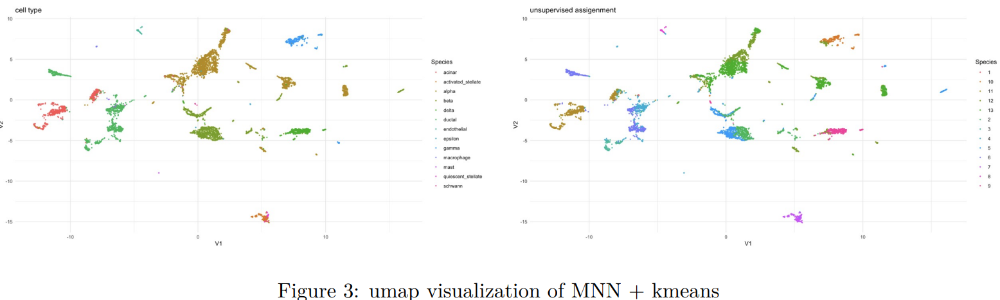
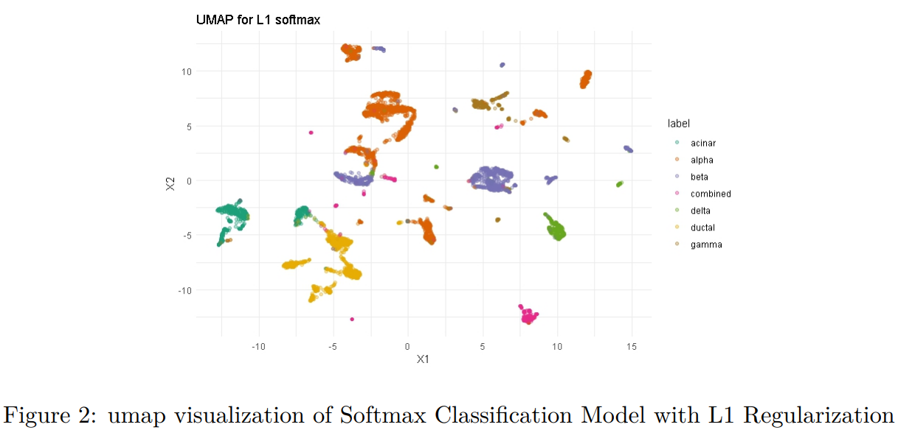

# 🌟 Pancreas scRNA-seq Reference Atlas Project 🌟

## 🚀 Introduction
Welcome to our *group 5* project repository! 🧬 This project is all about charting new territories in the pancreas using single-cell RNA sequencing (scRNA-seq) data. We're on a mission to conquer the challenges of batch effect correction and data high-dimensionality in scRNA-seq with some seriously advanced computational firepower! 💻

## 🛠 Methods
We've deployed three main computational wizards:
1. **Unsupervised Clustering (MNN + KMeans)**: 🔍 Identifying distinct cell types.
2. **GLM with Lasso Penalty**: 📐 Enhancing feature selection.
3. **Multi-Task Neural Network**: 🧠 A top-notch approach for cell type classification.

### 📈 Important Formula
One of our key formulas is the **GLM with Lasso Penalty**:

*Where X is the feature matrix, Y is the response vector, and alpha = 1 implies the lasso penalty.*

## 🌌 Results
Behold the power of our methods, especially the multi-task neural network, in classifying cell types with astronomical accuracy! 🌠

- 📊 **UMAP Visualization**:

  
  
  
  
  

- 📈 **ARI and NMI Index**:
  

## 👥 Collaboration
A big shout-out to our cosmic crew 🚀, who contributed to data processing, model development, and analysis. Every part of this project has been crafted with utmost care and precision.
Introduction and data processing was contributed by `Xintong`. GLM with Lasso penalty was contributed by `Bulun`, MNN + kmeans was contributed by `Kexin`, Multi-task Neural Network was contributed by `Xintong`. The final report was collaboratively drafted by all team members.

## 📁 Repository Structure
- `DeepNeuralNetwork/`: 🤖 Jupyter notebooks for transfer-learning and multilevel classification implemented with pytorch framework.
- `MNN/`: 🧼 Unsupervised learning via Mutual Nearest Neighbors, acclerated with Rcpp
- `SoftMaxLasso/`: 🧼 Generalized Logistic regression model with L1 regularization optimized by cpp-acclerated FISTA algorithm
- `Data/`: 📊 Original H5 Data `preprocessed_adata.h5ad` , PCA dimension reducted `adata_pca.csv`, and gene expression data `x_matrix`. Large files have been prtitioned into several zip files.

Thank you for visiting our project! We welcome your contributions and feedback to make this project even more !
